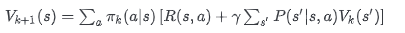
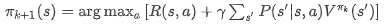
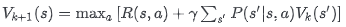
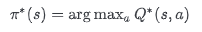

#### 

### 介绍

### 模型结构

#### Attention

#### MoE

#### Rope

#### MLA

MLA（Multi-head Latent Attention）是DeepSeek-V2/V3的核心创新，旨在**解决传统多头注意力（MHA）中KV Cache显存占用过高的问题**。主要利用如下的几个优化点

- 将KV投影到低维潜在空间存储，大幅减少Cache体积 
- 设计解耦的RoPE处理模块，解决位置编码与低秩压缩的兼容问题 
- 通过矩阵吸收技术，在推理时重组计算顺序减少显存访问。

#### MTP

### Tokenizer

### 模型预训练

1.预训练语料准备

minimind训练语料是从sft训练语料中进行处理提取的，并且jsonl中的每一个训练语料的长度均小于512（**注意后续自己制作数据集的时候，这个地方很重要，一定要控制最长的json的长度，如果很多的训练语料都超过了max_seq_length的时候，会导致在做dataset时候被截断，会导致模型一致学不到东西**)

2.预训练语料准备

为了得到高质量的训练语料，也是选用了匠心科技的SFT的13G左右中文问答语料。主要是获取它的input和output对。同时

3.训练的时候遇到的实际问题

复读机问题

- 预训练的语料有很大的比例超过了max_seq_length
- 预训练的质量较低，没有进行很好的清洗，导致在很少的flops中模型学不到东西。
- 训练的flops不够，可以增加epochs训练
- model.generate中temperature的值较低。

如果我们只是训练一个小的模型，训练的语料只有几十个G左右，这种情况下，最好的解决模型推理期间出现复读机的问题，还是去增加你的清洗规则，提升你训练语料的质量，这种情况下，在训练不到1/4 epoch的时候，模型就已经初步具有回答问题的能力，不会出现大量复读的问题。

> 模型核心配置
>
> |      字段名       | 默认值 | 说明                                                         |
> | :---------------: | :----: | :----------------------------------------------------------- |
> |  max_seq_length   |  512   | 对模型的总参数量没有影响，但是对模型的训练，推理，内存有比较明显的影响 1.训练语料大于max_seq_length会被截断，小于max_seq_length时会padding 2.在注意力机制计算的时候，创建因果掩码矩阵的时候，会影响其大小 3.RoPE进行位置编码的时候，也要注意该参数的影响 4.如果使用KVCache也会影响推理阶段内存的占用 |
> | global_batch_size |  1024  | batch_size * K(梯度累计的步数) * GPU G过大：直接导致每轮epoch的迭代次数变少，训练步数变少，在多轮epoch上不停地训练可能会过拟合该训练数据集 G过小：直接导致每轮epoch的迭代次数变多，训练步数变多，每次反向传播的时候噪声较多，训练不稳定，模型收敛慢。 |
> |                   |        |                                                              |
>

### SFT

1.SFT阶段并不是训练的数据量越大越好，指令的多样性和复杂性更加重要。

2.在SFT阶段引入新知识容易增加模型的产生幻觉的可能。模型主要是通过预训练阶段引入新的知识，而SFT的作用是教会模型如何高效正确地利用这些数据

SFT与预训练的一个显著区别就是两者的Loss计算规则不一样。

#### SFT数据集

### DPO(Direct Preference Optimization 直接偏好对齐)

#### 基本原理

大模型（如 ChatGPT）训练完后，可能输出 **不符合人类偏好** 的内容，比如：

- 答案冗长啰嗦 😤
- 包含错误或偏见 ❌
- 忽略关键问题 🙅

传统方法 **RLHF**（基于人类反馈的强化学习）能对齐偏好，但流程复杂：

1. 需额外训练一个 **奖励模型**（Reward Model）打分；
2. 再用强化学习（如 PPO）微调模型，过程不稳定且计算成本高。

👉 **DPO 的目标**：**跳过奖励模型**，直接用偏好数据微调模型，**更加简单高效地进行训练**！

### RL（强化学习）

策略迭代算法 VS 价值迭代算法

#### **一、策略迭代算法（Policy Iteration）**

**核心思想**：通过交替进行 **策略评估（Policy Evaluation）** 和 **策略改进（Policy Improvement）**，逐步优化策略直至收敛到最优策略

**适用场景**：状态空间较小的问题（如棋盘游戏、简单机器人控制）。

**具体步骤**：

1. **策略评估（Policy Evaluation）**

   - 固定当前策略 πk，通过贝尔曼方程迭代计算其状态价值函数 Vπk(s)：

     

   - 重复计算直至 V(s) 收敛（误差小于阈值）。

2. **策略改进（Policy Improvement）**

   - 基于当前 V(s)，对每个状态选择最大化动作价值 Q(s,a) 的动作：

     

   - 新策略 πk+1 是**贪婪策略**（只选当前最优动作）。

3. **循环迭代**：重复评估与改进，直到策略不再变化（πk+1=πk）。

**特点**：

- ✅ **优点**：策略序列单调改进，收敛稳定；
- ❌ **缺点**：策略评估需完全收敛，计算成本高（尤其大规模状态空间）。

#### **二、价值迭代算法（Value Iteration）**

**核心思想**：跳过显式策略，**直接优化状态价值函数 V(s)**，通过贝尔曼最优方程一步合并策略评估与改进

**适用场景**：大规模状态空间问题（如复杂路径规划）。

具体步骤：

1. **价值更新（Value Update）**

   - 直接迭代更新状态价值至最优值 V∗(s)：

     

   - 无需等待策略评估收敛，每次更新即隐含策略改进。

2. **策略提取（Policy Extraction）**

   - 收敛后，通过最优价值函数导出最优策略：

     

**特点**：

- ✅ **优点**：计算效率高（省去策略评估的多次迭代）；
- ❌ **缺点**：中间过程无显式策略，收敛前策略不可用。

#### **三、核心区别与联系**

| **维度**     | **策略迭代**                                  | **价值迭代**                   |
| :----------- | :-------------------------------------------- | :----------------------------- |
| **原理**     | 显式优化策略 π                                | 隐式优化值函数 V(s) → 导出策略 |
| **流程**     | 评估+改进交替                                 | 直接更新 V(s)（合并两步）      |
| **计算成本** | 高（需策略评估收敛）                          | 低（单次更新包含策略改进）     |
| **收敛速度** | 策略收敛快（少轮次）                          | 值函数收敛慢（多轮次）         |
| **适用性**   | 中小状态空间                                  | 大规模状态空间                 |
| **本质关联** | 价值迭代是策略迭代的极限简化（策略评估仅1次） |                                |

### RAG
